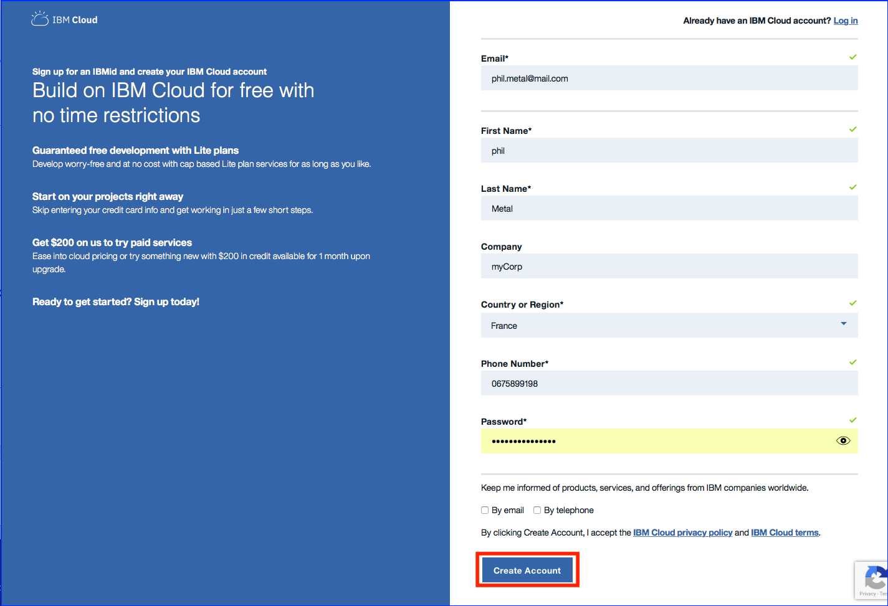
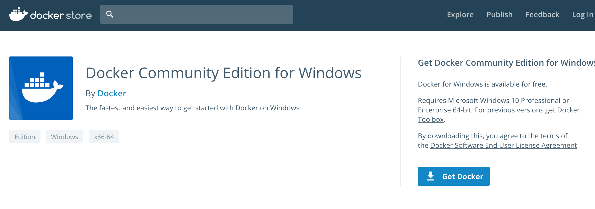
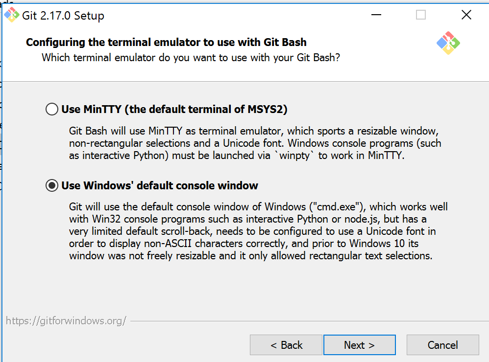

---

# Preparing the labs
---


---

## Table of Contents

- [Preparing the labs](#preparing-the-labs)
  * [Table of Contents](#table-of-contents)
- [Task 1. IBM Cloud registration](#task-1-ibm-cloud-registration)
    + [Sign in to IBM Cloud](#sign-in-to-ibm-cloud)
    + [Fill in the form](#fill-in-the-form)
    + [Confirm your registration to IBM Cloud from your inbox](#confirm-your-registration-to-ibm-cloud-from-your-inbox)
- [Task 2. Apply a promo code (if necessary)](#task-2-apply-a-promo-code--if-necessary-)
- [Task 3. Install Docker CE on your Mac](#task-3-install-docker-ce-on-your-mac)
- [Task 4. Install Docker CE on Windows](#task-4-install-docker-ce-on-windows)
- [Task 5. Install Git on your laptop](#task-5-install-git-on-your-laptop)
- [Task 6. Install the ibmcloud command](#task-6-install-the-ibmcloud-command)
- [Task 7. Login to IBM Cloud](#task-7-login-to-ibm-cloud)
- [Task 8. Node.JS](#task-8-Node.JS)
- [Task 9. Conclusion](#task-9-conclusion)


# Task 1. IBM Cloud registration

Before you can run all the labs, you should prepare your environment to execute those labs.

Labs are running on the **IBM Cloud** (ex Bluemix).

So before you can start any labs, you should have satisfied the following prerequisites :
- [ ] You should have **1 valid email** 
- [ ] Sign up to the **IBM Cloud** 

Here are some helpful steps :

### Sign in to IBM Cloud
If you don't have already registered to **IBM Cloud**,  
Open this link  [IBM Cloud](http://bluemix.net) or type http://bluemix.net in your favorite internet browser.


### Fill in the form
Specify last name, first name, corp, country, phone number and password.
> By **default**, all new people that register to IBM Cloud will have an **Lite Account** with **no time restriction**. This is not a 30 day trial account. 

Click on **Create Account** button. 



### Confirm your registration to IBM Cloud from your inbox
From your email application, confirm the account creation.


Log in to IBM Cloud with your credentials :


# Task 2. Apply a promo code (if necessary)

Check if you can access to **Containers in Kubernetes Clusters**.
To do so, click on **Catalog** and click on **Containers** on the left pane of the page :

 


> **IMPORTANT** : If you just see **Container Registry** and not the Containers in Kubernetes Clusters, then **you will need a promo code !!!**

> **IMPORTANT** : If you don't have a **promo code**, then ask IBM during the workshop. You can continue the other steps of this preparation and come back later to this step. However, to create a cluster, you will need a promo code.

To install a promo code, follow the procedure : 

Go to **Manage > Billing and Usage > Billing** and press enter.


You should get the following section in the billing page  :


Click **Apply Code** button.


Enter your **promo code** and click **Apply** 


> Close this window and **logout / login** to your account.

Go back to the **Catalog** and check that now you have access to **Containers in Kubernetes Clusters** and the Container Registry.


# Task 3. Install Docker CE on your Mac

> This step is mandatory if you want to go thru **Docker and Kubernetes labs**

Follow this procedure to install the latest Docker Community Edition on your Mac (**for Windows**, jump to the next session) 

Docker CE for Mac is free to download.

https://store.docker.com/editions/community/docker-ce-desktop-mac


Install it (click on the blue button **Get Docker**)

Double-click **Docker.dmg** to start the install process.

When the installation completes and Docker starts, the whale in the top status bar shows that Docker is running, and accessible from a terminal.


Open a terminal and type :

`docker version`

You should see something similar to this screen :
```console
phil:[node]: docker version
Client:
 Version:      18.03.1-ce
 API version:  1.37
 Go version:   go1.9.5
 Git commit:   9ee9f40
 Built:        Thu Apr 26 07:13:02 2018
 OS/Arch:      darwin/amd64
 Experimental: false
 Orchestrator: swarm

Server:
 Engine:
  Version:      18.03.1-ce
  API version:  1.37 (minimum version 1.12)
  Go version:   go1.9.5
  Git commit:   9ee9f40
  Built:        Thu Apr 26 07:22:38 2018
  OS/Arch:      linux/amd64
  Experimental: true

```
> Note that you should always have the client and the server running.

> The Docker server contains the **Docker engine**(containerd) that controls running containers. 


# Task 4. Install Docker CE on Windows

> This step is mandatory if you want to go thru **Docker and Kubernetes labs.**


Follow this procedure to install the latest Docker Community Edition on Windows (for Mac, jump to the previous session) 

Docker CE for Windows is free to download.

https://store.docker.com/editions/community/docker-ce-desktop-windows



Leave the default parameters: 


After download, install Docker CE

**Double-click Docker for Windows Installer** to run the installer.

> **IMPORTANT**: During the installation process, you may be informed the installer will reboot your workstation to install the virtualization feature of your PC. 


When the installation finishes, Docker starts automatically. The **whale** in the notification area indicates that Docker is running, and accessible from a terminal.

Open a command-line terminal like PowerShell, and try out some Docker commands!

Run docker version to check the version.

`docker version`

You should see something similar to this screen :
```console
phil:[node]: docker version
Client:
 Version:      18.03.1-ce
 API version:  1.37
 Go version:   go1.9.5
 Git commit:   9ee9f40
 Built:        Thu Apr 26 07:13:02 2018
 OS/Arch:      Windows/amd64
 Experimental: false
 Orchestrator: swarm

Server:
 Engine:
  Version:      18.03.1-ce
  API version:  1.37 (minimum version 1.12)
  Go version:   go1.9.5
  Git commit:   9ee9f40
  Built:        Thu Apr 26 07:22:38 2018
  OS/Arch:      Windows/amd64
  Experimental: true

```
> Note that you should always have the client and the server running.

> The Docker server contains the **Docker engine**(containerd) that controls running containers. 

# Task 5. Install Git on your laptop

To do so : 

For MacOS :
http://mac.github.com

For Windows: 
http://git-scm.com/download/win

At some point during the installation, change to the **"Use Windows default console"** and continue the installation.


# Task 6. Install the ibmcloud command

The **ibmcloud** command line interface (CLI) provides a set of commands that are grouped by namespace for users to interact with IBM Cloud. In previous versions, the name of that command was "bluemix" or "bx".

You install a set of IBM® Cloud developer tools, verify the installation, and configure your environment. IBM® Cloud developer tools offer a command-line approach to creating, developing, and deploying end-to-end web, mobile, and microservice applications.

With this installation, you get the stand-alone IBM Cloud CLI, plus the following tools:

Homebrew (Mac only)
Git
Docker
Helm
kubectl
curl
IBM Cloud Developer Tools plug-in
IBM Cloud Functions plug-in
IBM Cloud Container Registry plug-in
IBM Cloud Kubernetes Service plug-in
sdk-gen plug-in

For MacOS or Linux:
`curl -sL https://ibm.biz/idt-installer | bash`

For Windows: 
```
Set-ExecutionPolicy Unrestricted; iex(New-Object Net.WebClient).DownloadString('http://ibm.biz/idt-win-installer')
```


Results:

```console
$ curl -sL https://ibm.biz/idt-installer | bash
[main] --==[ IBM Cloud Developer Tools for Linux/MacOS - Installer, v1.2.3 ]==--
[install] Starting Update...
[install] Note: You may be prompted for your 'sudo' password during install.
[install_deps] Checking for external dependency: brew
[install_deps] Installing/updating external dependency: git
[install_deps] Installing/updating external dependency: docker
[install_deps] Installing/updating external dependency: kubectl
[install_deps] Installing/updating external dependency: helm
[install_bx] Updating existing IBM Cloud 'bx' CLI...
Checking for updates...
No update required. Your CLI is already up-to-date.
[install_bx] Running 'bx --version'...
bx version 0.10.1+793a333-2018-09-20T06:29:40+00:00
[install_plugins] Installing/updating IBM Cloud CLI plugins used by IDT...
[install_plugins] Checking status of plugin: cloud-functions
[install_plugins] Installing plugin 'cloud-functions'
Looking up 'cloud-functions' from repository 'IBM Cloud'...
Plug-in 'cloud-functions 1.0.23' found in repository 'IBM Cloud'
Plug-in 'cloud-functions/wsk/functions/fn 1.0.22' was already installed. Do you want to update it with 'cloud-functions 1.0.23' or not? [y/N]> 
FAILED
Could not read from input: EOF

[install_plugins] Checking status of plugin: container-registry
[install_plugins] Updating plugin 'container-registry' from version '0.1.339'
Plug-in 'container-registry 0.1.339' was installed.
Checking upgrades for plug-in 'container-registry' from repository 'IBM Cloud'...
No updates are available.
[install_plugins] Checking status of plugin: container-service
[install_plugins] Installing plugin 'container-service'
Looking up 'container-service' from repository 'IBM Cloud'...
Plug-in 'container-service/kubernetes-service 0.1.593' found in repository 'IBM Cloud'
Plug-in 'container-service/kubernetes-service 0.1.581' was already installed. Do you want to update it with 'container-service/kubernetes-service 0.1.593' or not? [y/N]> 
FAILED
Could not read from input: EOF

[install_plugins] Checking status of plugin: dev
[install_plugins] Updating plugin 'dev' from version '2.1.4'
Plug-in 'dev 2.1.4' was installed.
Checking upgrades for plug-in 'dev' from repository 'IBM Cloud'...
No updates are available.
[install_plugins] Checking status of plugin: sdk-gen
[install_plugins] Updating plugin 'sdk-gen' from version '0.1.12'
Plug-in 'sdk-gen 0.1.12' was installed.
Checking upgrades for plug-in 'sdk-gen' from repository 'IBM Cloud'...
No updates are available.
[install_plugins] Running 'bx plugin list'...
Listing installed plug-ins...

Plugin Name                            Version   
cloud-functions/wsk/functions/fn       1.0.22   
container-registry                     0.1.339   
container-service/kubernetes-service   0.1.581   
dev                                    2.1.4   
icp                                    2.1.284   
schematics                             1.2.0   
sdk-gen                                0.1.12   
IBM-Containers                         1.0.1058   

[install_plugins] Finished installing/updating plugins
Password:
[env_setup] The following shortcuts defined to access the IBM Cloud Developer Tools CLI:
[env_setup]   idt           : Main command, shorthand for 'bx dev'
[env_setup]   idt update    : Update your IBM Cloud Developer Tools to the latest version
[env_setup]   idt uninstall : Uninstall the IBM Cloud Developer Tools
[install] Install finished.
[main] --==[ Total time: 423 seconds ]==--

```
To verify that the CLI and developer tools were installed successfully, run the help command:

`ibmcloud dev help`

Results:

```console
ibmcloud dev help
NAME:
   ibmcloud dev - A CLI plugin to create, manage, and run applications on IBM Cloud

USAGE:
   ibmcloud dev command [arguments...] [command options]

VERSION:
   2.1.4

COMMANDS:
   build             Build the application in a local container
   code              Download the code from an application
   console           Opens the IBM Cloud console for an application
   create            Creates a new application and gives you the option to add services
   diag              This command displays version information about installed dependencies
   debug             Debug your application in a local container
   delete            Deletes an application from your space
   deploy            Deploy an application to IBM Cloud
   edit              Add or remove services for your application
   enable            Add IBM Cloud files to an existing application.
   get-credentials   Gets credentials required by the application to enable use of connected services.
   list              List all IBM Cloud applications in a space
   run               Run your application in a local container
   shell             Open a shell into a local container
   status            Check the status of the containers used by the CLI
   stop              Stop a container
   test              Test your application in a local container
   view              View the URL of your application
   help              Show help
   
Enter 'ibmcloud dev help [command]' for more information about a command.

GLOBAL OPTIONS:
   --version, -v                  Print the version
   --help, -h                     Show help

```

You can also verify your CLI installation by typing:

`ibmcloud plugin list` 

Results:

```console
ibmcloud plugin list
Listing installed plug-ins...

Plugin Name                            Version   
container-registry                     0.1.339   
container-service/kubernetes-service   0.1.581   
dev                                    2.1.4   
icp                                    2.1.284   
schematics                             1.2.0   
sdk-gen                                0.1.12   
IBM-Containers                         1.0.1058   
cloud-functions/wsk/functions/fn       1.0.22 
```

# Task 7. Login to IBM Cloud

 Login to IBM Cloud with the ic command :
 
 `ibmcloud login -a api.eu-gb.bluemix.net`
 
 And answer a few questions: email, password, account, 
 
 ```console 
$ ibmcloud login -a api.eu-gb.bluemix.net
API endpoint: api.eu-gb.bluemix.net

Email> philmetal@mail.com

Password> 
Authenticating...
OK

Targeted account rock metal (4d327e6ba61d02089dab9af842d267c9)
Targeted resource group Default
                     
API endpoint:     https://api.eu-gb.bluemix.net (API version: 2.92.0)   
Region:           eu-gb   
User:             philmetal@mail.com   
Account:          rock metal (4d327e6ba61d02089dab9af842d267c9)   
Resource group:   Default   
Org:                 
Space:               

Tip: If you are managing Cloud Foundry applications and services
- Use 'ic target --cf' to target Cloud Foundry org/space interactively, or use 'ic target -o ORG -s SPACE' to target the org/space.
- Use 'ic cf' if you want to run the Cloud Foundry CLI with current IBM Cloud CLI context.

````

And optionally, you can also specify the following ORG and SPACE with that command :

`ibmcloud target --cf`

Results:
```console
# ibmcloud target --cf
Targeted Cloud Foundry (https://api.eu-gb.bluemix.net)

Targeted org philament@mail.com

Targeted space dev
                      
API endpoint:      https://api.eu-gb.bluemix.net   
Region:            eu-gb   
User:              philament@mail.com   
Account:           philament corp (022bbfb763d37397d0dfd18217c33c6c)   
Resource group:    Default   
CF API endpoint:   https://api.eu-gb.bluemix.net (API version: 2.106.0)   
Org:               philament@mail.com   
Space:             dev     

```

Or you can also use :

`ibmcloud target -o <value> -s <value>`

Where -o is your **email** and -s is the **dev** space.

# Task 8. Node.js

Some labs require Node.js.

From that link:
https://nodejs.org/en/

Choose the LST version of Node.js for your laptop.

# Task 9. Conclusion

###  Results
<span style="background-color:yellow;">Successful exercise ! </span>

You finally went thru the following features :
- [x] You registered to IBM Cloud
- [x] You applied a promo code
- [x] You installed Docker on your laptop
- [x] You installed Git
- [x] You installed the ic command
- [x] You login to IBM Cloud successfully
- [x] You are ready for the labs
---
# End of the lab
---


---

