---
# IBM Cloud - Internet of Things
---

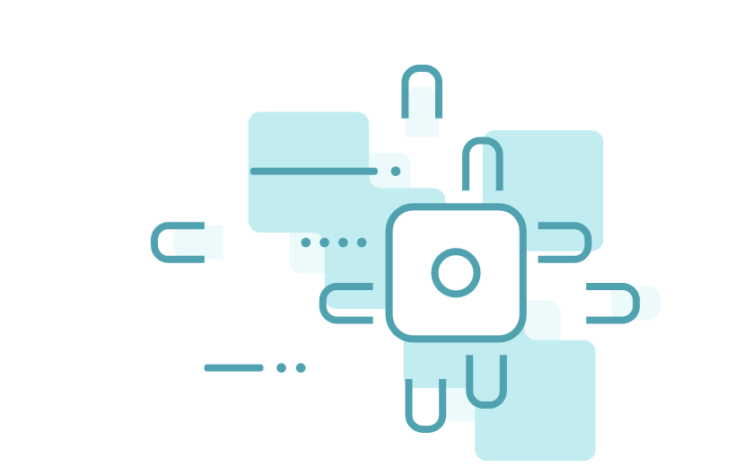
+++

## Table of Content

- [1. Creating and connecting an IoT device simulator](#1-creating-and-connecting-an-iot-device-simulator)
- [2. Objectives](#2-objectives)
- [3. Create IoT Platform](#3-create-iot-platform)
    + [task 1. Log in to IBM Cloud at: https://bluemix.net](#task-1-log-in-to-ibm-cloud-at--https---bluemixnet)
    + [Task 2. Click on the Catalog tab and select **Starter Kits** on the left side:](#task-2-click-on-the-catalog-tab-and-select---starter-kits---on-the-left-side-)
    + [Task 3. Locate and click on the  Internet of Things Platform Starter tile.](#task-3-locate-and-click-on-the--internet-of-things-platform-starter-tile)
    + [Task 4. On the IoT platform Starter page](#task-4-on-the-iot-platform-starter-page)
    + [Task 5. Do you see the green light](#task-5-do-you-see-the-green-light)
    + [Task 6. Node-RED flow Editor](#task-6-node-red-flow-editor)
- [4. Register your device](#4-register-your-device)
    + [Task 1. Go back to the **Dashboard**](#task-1-go-back-to-the---dashboard--)
    + [Task 2. IoT platform access](#task-2-iot-platform-access)
    + [Task 3. Click LAUNCH  IoT Dashboard](#task-3-click-launch--iot-dashboard)
    + [Task 4. Select Devices](#task-4-select-devices)
    + [Task 5. Click Add Device button](#task-5-click-add-device-button)
    + [Task 6. Fill the device information](#task-6-fill-the-device-information)
    + [Task 7. Security : Provide a token](#task-7-security---provide-a-token)
    + [Task 8. Summary](#task-8-summary)
- [5. Simulate your device](#5-simulate-your-device)
    + [Task 1. Device Simulator](#task-1-device-simulator)
    + [Task 2. Clone the simulator application:](#task-2-clone-the-simulator-application-)
    + [Task 3. Configure your simulator application](#task-3-configure-your-simulator-application)
    + [Task 4. Start the simulator](#task-4-start-the-simulator)
- [6. Visualisation](#6-visualisation)
    + [Task 1. Dashboard](#task-1-dashboard)
    + [Task 2. Node-Red](#task-2-node-red)
- [8. Conclusion](#8-conclusion)

+++

# 1. Creating and connecting an IoT device simulator

Use **Watson Internet of Things (IoT) platform** and **Node-Red **to visualize data sent by a simulated device running on your laptop (local Node.js application) using MQTT protocol. 
Node-RED is a tool for wiring together hardware devices, APIs and online services in new and interesting ways. For more information, see the Node-RED web site. 
You can run your Node-RED instance in your own environment or use it as a IBM Cloud application. The following process includes the instructions for IBM Cloud.

# 2. Objectives 

In this lab, you create an IoT platform and use Node-Red to simulate a device to produce some metrics. 

> **this lab needs Node.JS to be installed** for the last step.

# 3. Create IoT Platform
 
Create your Node-Red application and IoT Platform in one step by using the IoT platform Starter boilerplate.

### task 1.	Log in to IBM Cloud 

Here:  https://bluemix.net

 
### Task 2. Catalog

Click on the Catalog tab and select **Starter Kits** on the left side:

 
### Task 3.	Starter Kits

Locate and **click** on the  Internet of Things Platform Starter tile. 

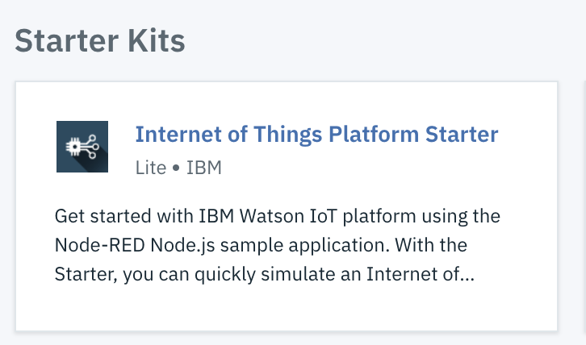
 
### Task 4.	Create your IoT platform

Define a unique name with you initials like **IoTxxx**, and click **Create** to add a new Node-Red application to your IBM Cloud organization. **Node-RED** is a Node.JS program that use a Cloudant NoSQL database and an IoT Platform service. 

Fill or review the form:
- Unique App name
- Unique Host name
- Domain
- Region
- Organization (your email generally)
- and space

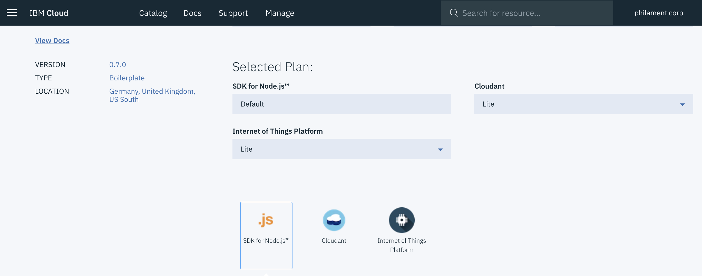 

Click on **Create**

Note: The staging process might take a few minutes (**5 minutes **or so). Refresh the screen. The light could be red at some point in time.

 
 

### Task 5.	Do you see the green light

  
 
The application is running. Then click the **View App URL** button on the top to open the **Node-RED application**. You may be directed to a special page asking to secure your Node-RED instance: Click **Next**.

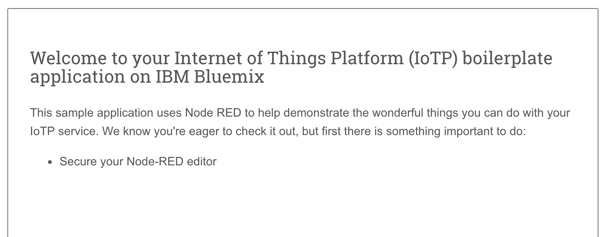

 
On the “Secure your Node-RED editor”, choose the **no secure** option for this lab.

 
Then click **Next** and **Finish**. 
A page showing the Node-RED intro should appear:

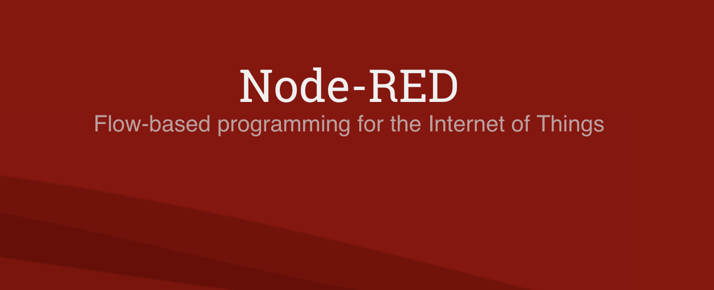
 
### Task 6.	Node-RED flow Editor

Click Go to your Node-RED flow editor to open the editor. In the editor, there are already 2 sample flows. 

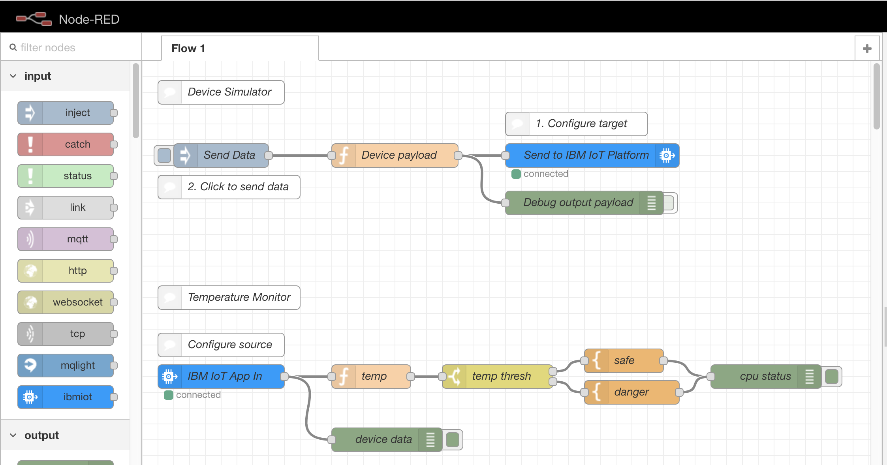

Spend some time looking around in the node **palette** on the left hand to see all the **connectors** that you can drag and drop in the flow (in the middle of the screen). On the right hand, you can see the **info tab** (properties) when selecting a specific node in the flow. The debug will be used later on to visualize messages coming from the flow and generated by the green node (msg.payload).

 
# 4. Register your device

Create and Register your device with IoT Platform service.

Follow these steps to get access to this service. 
### Task 1.	Go back to the **Dashboard** 

Click on IBM Cloud on the top left part of the screen and Click on your application IoTxxx:
 
 
 
### Task 2.	IoT platform access

At the bottom of the screen, you should see 2 services (one is the **Cloudant** database and the other one is the **Internet of Things Platform service**). The IBM Internet of Things Platform service lets your apps communicate with and consume data collected by your connected devices, sensors, and gateways. Our recipes make it super easy to get devices connected to our Internet of Things cloud. Your apps can then use our real-time and REST APIs to communicate with your devices and consume the data you've set them up to collect. **Click on the IoT Platform service**. This is launching the IoT platform console. 

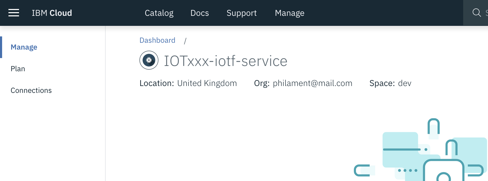 
 
### Task 3.	LAUNCH  IoT Dashboard 

Click the LAUNCH green button.
> it can take a few minutes.
 
### Task 4. Select Devices 

On the left (the little circuit):

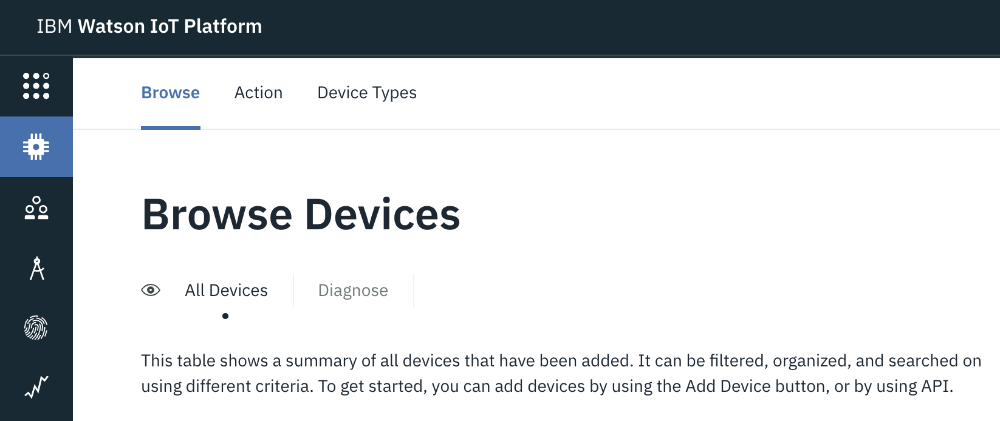 
 
### Task 5. Add a device

Click Add Device button

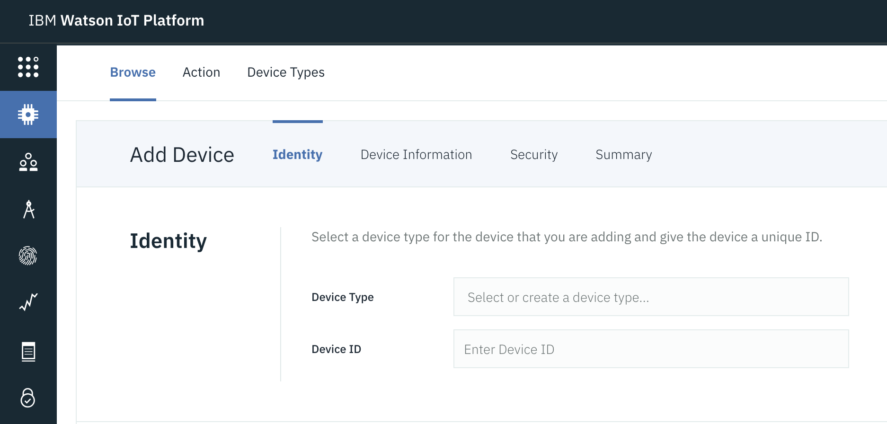 

Type a name for the Device type :  **DeviceType1**
and a device ID : **100i700**

 

Click **Next**
 
### Task 6. Fill the device information

Enter Device information :

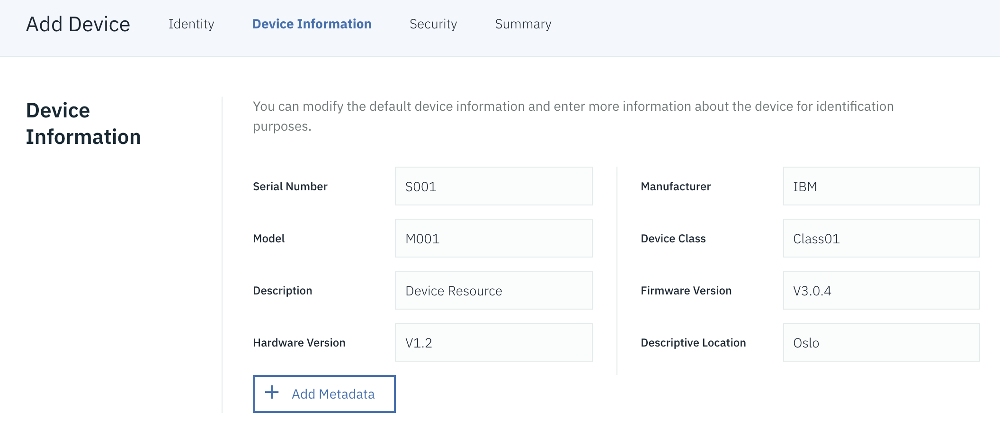 

### Task 7.	Security - Provide a token

Type a token : **MyToken1**
Click **Next** and **Add** to add a device.
 
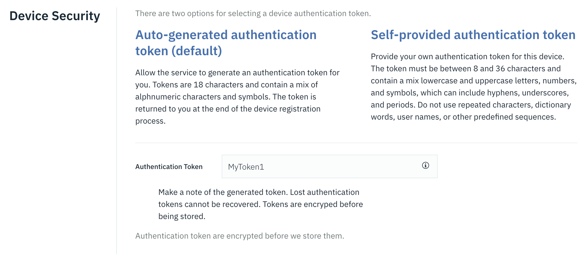 

 
### Task 8.	Summary 

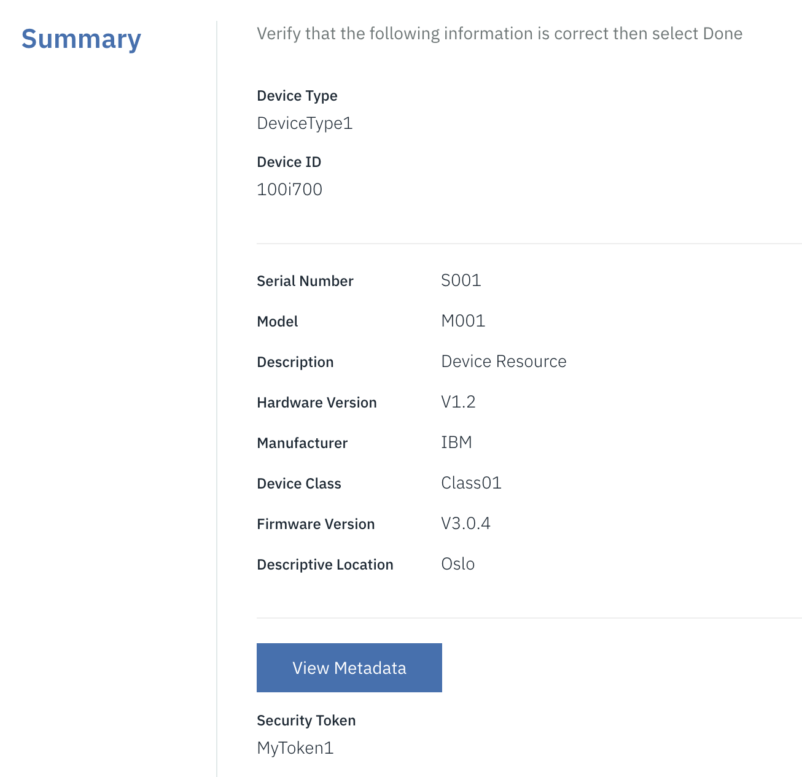 

 Review all the information and type **Done**
 
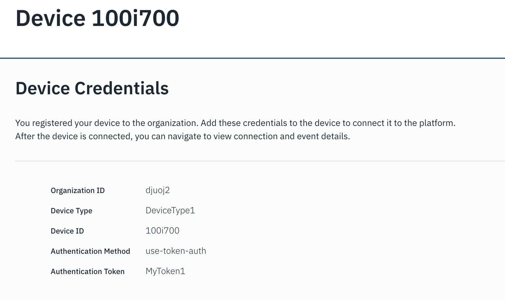 
 
 > Take a note of all the device security information.

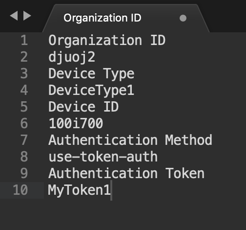 
 
# 5. Simulate your device
 
We are going to simulate a device on your laptop by using a node application and connect this device to IoT Platform. 

### Task 1.	Device Simulator

On your machine, open a terminal window or a command line window, create a new directory for DeviceSimulator and get the git clone of the simulator app :

`mkdir DeviceSimulator`

`cd DeviceSimulator`

### Task 2.	Clone the simulator application:

`git clone https://github.com/gmagie/device-simulator-for-ibm-iot`

`cd device-simulator-for-ibm-iot` 

`cd device-simulator-for-ibm-iot-master`

### Task 3. Configure your simulator application

Depending of your operating system, duplicate and rename a file called .env.example

MacOS or Linux 
`cp .env.example .env`

Windows
`copy .env.example .env`	

Edit the .env file with a text editor of your choice (nano, vi or notepad) and Replace all the values with the one you saved earlier.

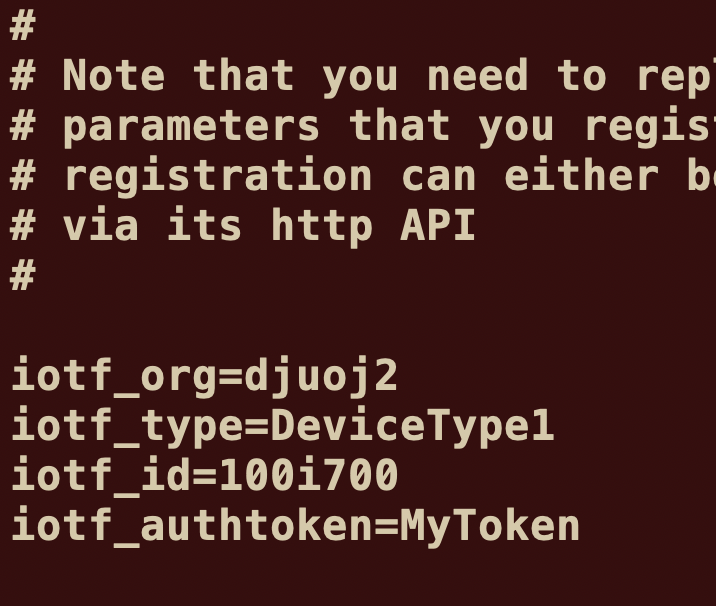 
  
Double check all the fields and Save the file.

### Task 4. Start the simulator

Start node with the following command :

`npm install`

`node app.js`

 
 
At this point you should see this running application (simulating a device) is connected to the IoT platform service and some data (temperature, pressure and humidity) is being sent to the platform.

# 6. Visualisation
 
Validate the device connection and visualize the data in Node-RED.

### Task 1. Dashboard

At this point, go back the IoT platform dashboard:

 

Our device should be connected and you should see some date coming. 

Click on the device and scroll the page to the sensor information:

 
Click on the **recent events:** to see all the events coming from the simulated device (our application) :
 
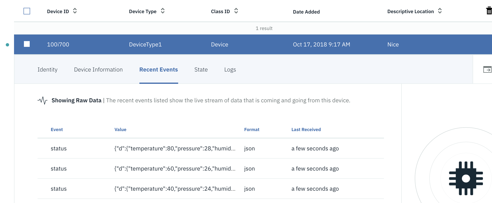
 
 

### Task 2.	Node-Red

Then go back to the **Node-RED flow editor**. With your mouse, select all the flows and boxes in the Flow 1 and **clear the Flow 1**. The screen should looks like that after the clear:

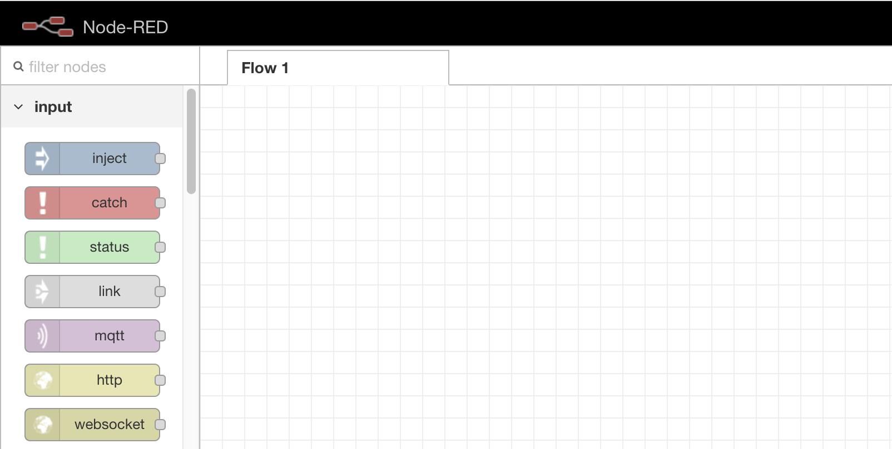
 

Drag the **ibmiot input node** from the left section and drop it on to the center app development environment. **Drag the debug output node** from the left section and drop it on to the center app development environment to the right of the ibmiot node. **Connect the 2 nodes**. It should look like this:

 
**Double click the IBM IoT node**. Update the Authentication section to **Bluemix Service** and update the Device id section to the DeviceID of your simulated device i.e. **100i700**

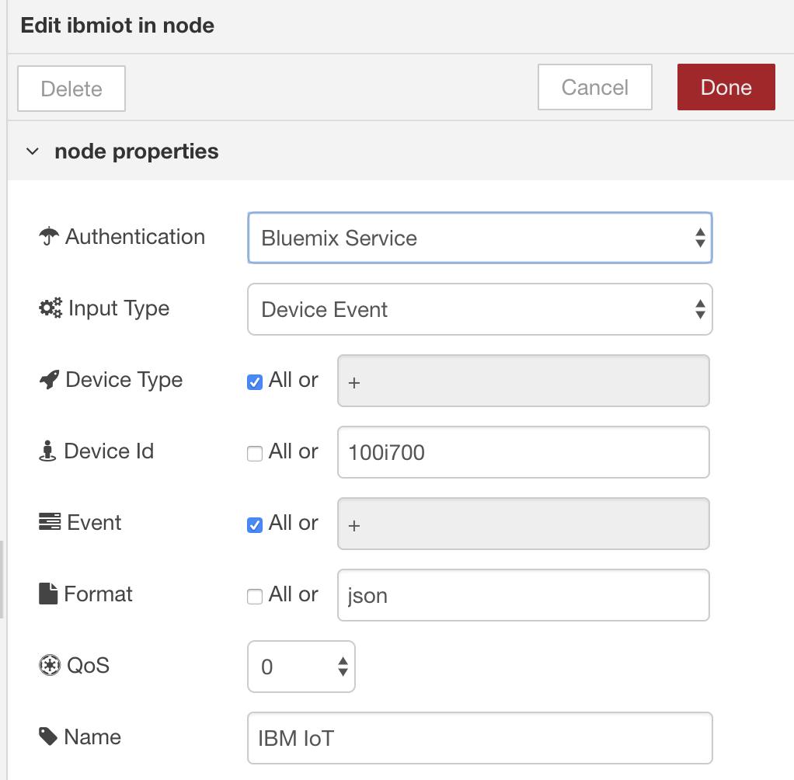

Click **Done**
 
Click **Deploy** on the top tight section (Note, anytime there is a change in the app, the Deploy button turns red and it needs to be deployed for the change to take effect). The green icon and connected should appear below the IBM IoT flow.  

 
Go to the **debug tab **on the right section of the node-red and you will see the MQTT data being sent from the device to the node-red. If you click on the cursor in front of the object, you will see the temperature, pressure, humidity … 

 
You can enhance this flow with a lot of features (logic, database …)  and play with Node-RED.

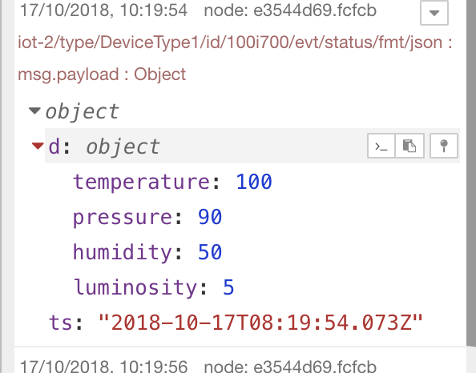

# 8. Conclusion
Successful exercise ! 

You learned how to use the IBM Internet of Things, Node-Red and a Node application to implement MQTT messages to send and collect metrics. 

---
# End of Lab
---

